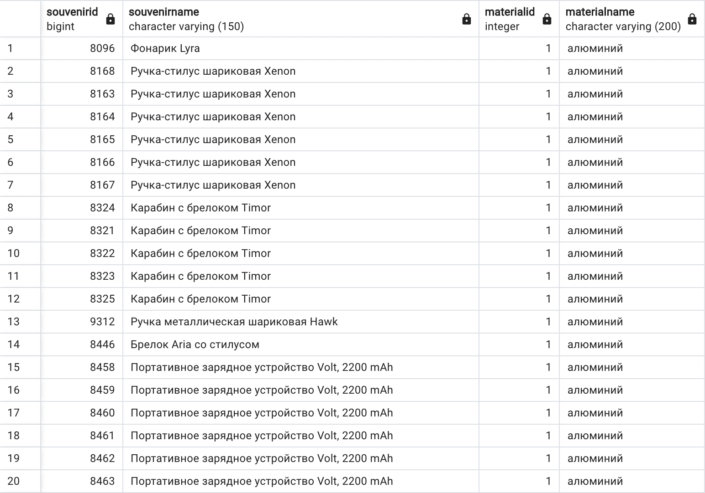
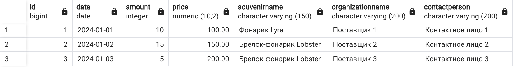
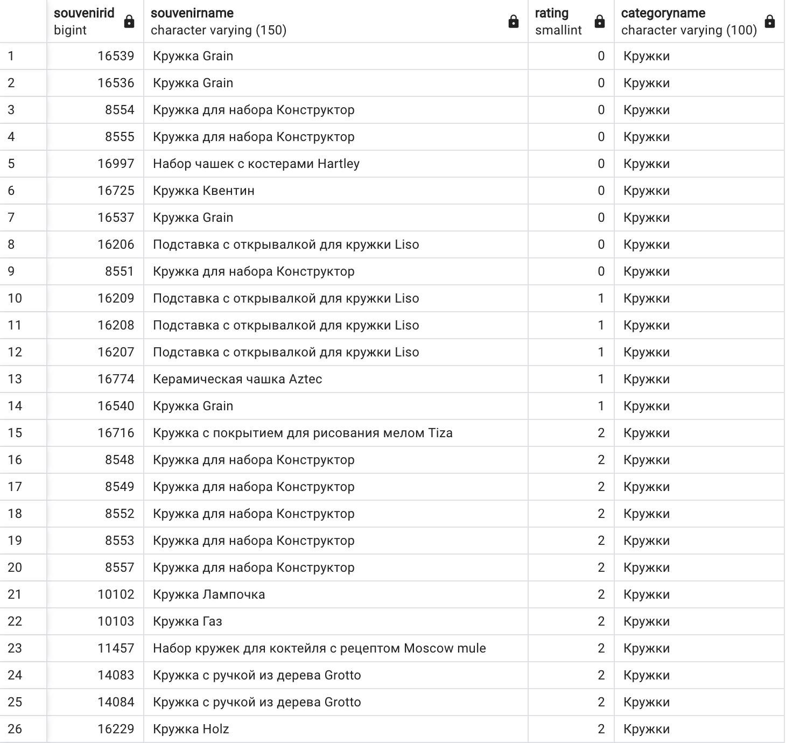
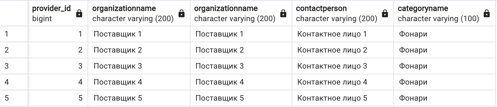
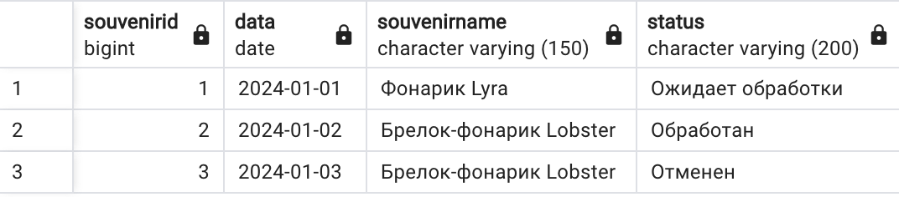
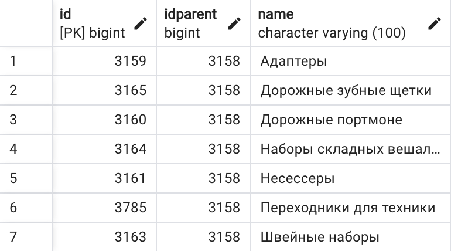
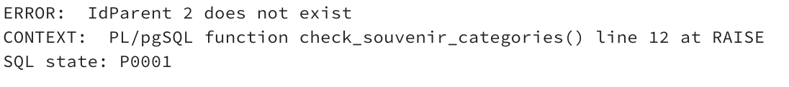
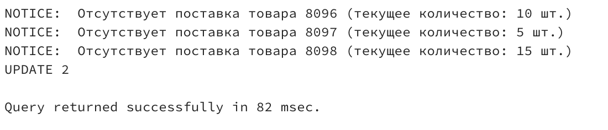

# Реализация объектов баз данных

## I.
В папке «Ресурсы» вам предоставлены схема баз данных `ERD.vsdx` и `DataDictionary.docx`. Изучите предоставленные документы и создайте базу данных с набором таблиц, представленных в схеме данных, а затем импортируйте туда необходимые данные. Необходимые для импорта данные из файлов `categories.txt` и `data.xls` так же представлены в папке «Ресурсы». Все данные должны быть импортированы в базу данных. Если данных для импорта в какую-либо из таблиц нет, необходимо заполнить таблицы тестовыми данными (не менее 5 записей).

### Описание предметной области:
Фирма занимается продажей сувенирной продукции, и чтобы удержаться на рынке следит за ценами своих поставок, качеством поставщиков и старается дать максимальное описание своего товара, чтобы клиенты могли по своим отрывочным описаниям найти то, что им нужно.
Вам предоставлена ER-диаграмма и Словарь данных, не стоит забывать о нормализации и целесообразном выделении места для хранения данных.
После импорта создайте скрипт со схемой данных и данными, назовите скрипт «База данных_X.sql», гле `Х` – номер вашего рабочего места. 
Для проверки вам необходимо передать скрипт `База данных_X.sql`

## II.	

### Реализуйте запросы. Запросы сохраните в текстовый файл и скриншот результата запроса и передайте экспертной группе для оценки. 

1.	Создать запрос на выборку сувениров по материалу.

2.	Создать запрос на выборку поставок сувениров за промежуток времени.

3.	Создать запрос на выборку сувениров по категориям и отсортировать по популярности от самого непопулярного.

4.	Создать запрос на выборку всех поставщиков, поставляющих категорию товара.

5.	Создать запрос на выборку поставок сувениров за промежуток времени и отсортировать по статусу.

6.	Создать объект для вывода категорий, в зависимости от выбранной.

7.	Создать объект для проверки правильности занесения данных в таблицу `SouvenirsCategories`.

8.	Создать объект оповещения пользователя при отсутствии поставок товаров, отсутствующих на складе или количество которых меньше чем 50 шт.

